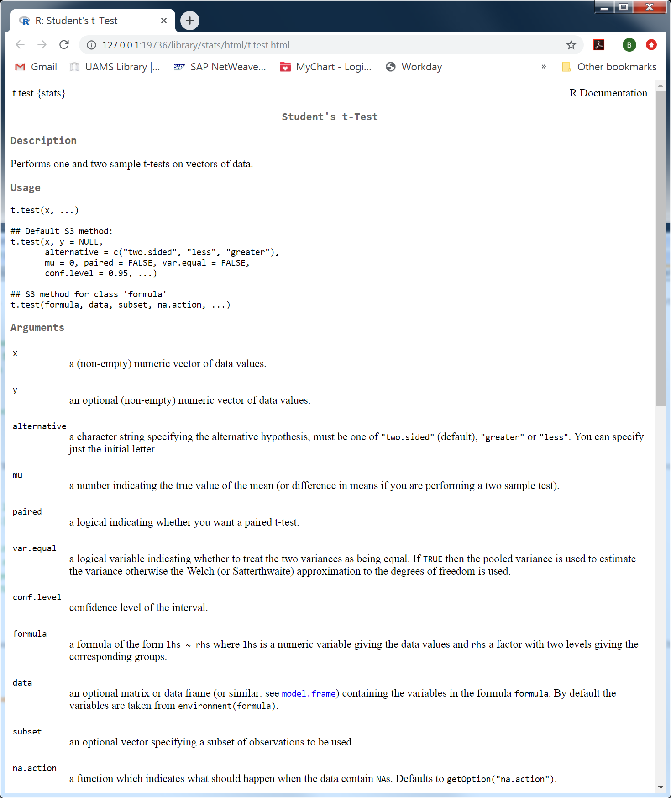

# Basics of R {#rbasics}

## R

R is an __object-oriented__ programming language that was developed for statistical computing and visualization.  It is freely available under the [GNU General Public License](https://www.gnu.org/licenses/gpl-3.0.html) and has a large and active user community.  Figure 2.1 describes the most visited languages comparable to the R user base at [Stack Overflow](https://stackoverflow.com/) the largest question and answer programming site.  Note the sustained linear growth since 2012.

(ref:SOFdr) From stackoverflow blog: [_The Impressive Growth of R_](https://stackoverflow.blog/2017/10/10/impressive-growth-r/). By David Robinson, 10/10/2017.

```{r SOFdr, fig.cap='(ref:SOFdr)', out.width='80%', fig.asp=.75, fig.align='center', echo=FALSE}
knitr::include_graphics("plot_tags_time-1-768x768.png")
```

I bolded __object-oriented__ because it highlights a major advantage of __reproducibility__ in R and other programming-based langauge.  Everything that is done in R uses named objects as either __functions__ or __data__.  Understanding how functions manipulate __data types__ and __data structures__ is the foundation of working with R.  For example, if you want to obtain the mean over a set of numbers, the `mean` function is used to determine the mean of numbers within a __vector__.  These bolded words and phrases may seem abstract at this point, but this chapter will expand these concepts.

This chapter is dedicated to basic concepts needed to complete this course.  Googling your question will more often then not provide an answer to your question, but there are several online tutorials for those interested in a deeper understanding of R.  Several of these courses are listed below.

- [DataCamp](https://www.datacamp.com/courses/free-introduction-to-r)
- [Coursera](https://www.coursera.org/specializations/jhu-data-science)
- [statistics.com](https://www.statistics.com/landing-page/r-courses/)
- [codecademy](https://www.codecademy.com/learn/learn-r)

Many of these excellent courses were not available when I learned R.  I extensively used the [Quick-R](https://www.statmethods.net/index.html) website by Robert Kabacoff as I learned how to use R.  I will be providing links periodically to Quick-R for additional information not covered in this chapter.

## Downloading R

First step is to downloading R.  R is available at the [The Comprehensive R Archive Network](https://cran.r-project.org/) (CRAN) website.  Figure 2.2 shows the website and note the links needed for different systems are in a box at the top of the website.  The default downloading prompts will result in aquiring 32 and 64 bit version for Windows users.  You will likely be running a 64-bit Windows, but please refer [here](https://support.microsoft.com/en-hk/help/15056/windows-32-64-bit-faq) if you want to check your Windows version.  

(ref:Rwebsite) CRAN website

```{r Rwebsite, fig.cap='(ref:Rwebsite)', out.width='80%', fig.asp=.75, fig.align='center', echo=FALSE}
knitr::include_graphics("cran.png")
```

## The R console

Figure 2.3 shows the R console after opening.  Our color scheme differ because I customized my colors, but the information should be very similar.  This is the R console and it is where you will type in code or pass code to run, causing R to work. 

(ref:Rconsole) R console

```{r Rconsole, fig.cap='(ref:Rconsole)', out.width='80%', fig.asp=.75, fig.align='center', echo=FALSE}
knitr::include_graphics("Rconsole.png")
```

Let's try some basic operations.  Type in 2 + 2, or copy the inline code (R code within the text) below, paste it into your R console, and press enter.  Note, since this web-book was written in R, there will typically be an output box after provided code.

```{r firstop}
# Operations after hashtag will not be processed by R.  Good way to write notes!
2 + 2
```

You should see the output is '4' like the output box above this text.  Now let's make a data object!  Cut and paste the code below to make an object that contains the results of 2 + 2

```{r firstobject}
# The '<-' is referred to as an assignment operator.  Use this when defining the name of an object.
object1 <- 2 + 2
object1
```

The output is 4, which is what the object contains.  Try the next line of code to verify that 'object1' is the number 4.

```{r object1test}
# Output should be 400.
object1 * 100
```

The name of the object can be anything you want as long as it doesn't start with a number or special characters.  It can be as short as a single letter or as long as you want.  Recommend making object names as short and succinct as possible.  R is also __case sensitive__.  Obj2 and obj2 are 2 different objects.  Periods (.) and underscores are allowable, but special characters are not.  Try to make use of periods or underscores for readability, e.g., Obj1_MEAN.

You can add more numbers using the `c` function, for example.

```{r cfun}
# the c() function means either combine or concatenate.  
obj2 <- c(5, 6.3, 3, 0, -1, 13, 7)
obj2
```

We can now take the mean of obj2 using the `mean` function.  Note, the `mean` function is a specialized object that performs and action on a data object.  We will cover this in more detail.

```{r meanfun}
# In almost every case, an object will go inside the function's parantheses.    
mean(obj2)
```

## The R script

So far, we've been typing directly into the console.  When you close R, you will normally lose everything you've done during the session.  You can, however, write and save your code on a specialized text file (script).  This will allow you to replicate your results every time you open a new R session.  There is an intrinsic R script option in your R environment.  Click File and then select 'New Script'.  You will see a blank window titled, 'Untitled - R Editor.'  You can then type R commands in this window.  Copy and paste the following code to the R Editor.  To run this code, highlight all of the code with your mouse and then press Ctrl+R (hold down control and press the R key on your keyboard).  You can also run the script by pressing Ctrl+R line by line.

```{r obj2logic}
obj3 <- c(5, -1, 3, -10, -2, -12, 15, 0)

# The <= means 'less than or equal to'
# >= means 'greater than or equal to'
obj3 <= 0

```

A very popular modular script editor is [RStudio](https://www.rstudio.com/). RStudio is open-source and free! It nicely packages the R console, script(s), help pages, and graphical outputs in a convenient program (Figure 2.4).  Many new users find RStudio extremely helpful.  There are other text/script editors, but very few will pass your code directly to the R console like RStudio. 

## R packages

You have been introduced to a couple functions that appear to be pre-loaded in R.  Functions are what really drive R and makes it such a flexible tool.  Anyone can write a function, and many, many people have.  This is how people contribute to the growth of R, by releasing __packages__ of R functions that perform specific tasks to their fields.  In fact, the `mean` and `c` functions we used in 2.3 and 2.4 are contained in a preloaded 'base' package.  Most of the preloaded packages contain core functions and widely used statistical and plotting functions.  We will eventually be loading packages specific to ecology and microbial sequencing data, but let's first learn how to identify and download packages.

After you download R, the only packages you have are the core packages.  You will have to identify packages you need and download them.  The R community has 3 major repositories for R packages:

1. CRAN
2. Bioconductor
3. Github

You only have to install a package once; however, downloaded packages do not automatically load.  You will have to load these add-on packages using the `library` function.  

Additional information about R packages, including installing packages using the R menu, can be viewed [here](https://www.statmethods.net/interface/packages.html)

### CRAN

CRAN is the major repository of R packages.  If you refer to their website (linked in 2.2) and select the 'Package' link under the _Software_ header, you will see that there are almost 15,000 R packages available.  You can view a table of all 15,000 packages, but this seems incredibly cumbersome way to identify a certain package. Fortunately, CRAN has a Task View option in the side-panel under __CRAN__. If you click the 'Task View' link you will see a list of topics that may be relevant to your field (Figure 2.6).  Find 'Phylogenetics' and press that link.  In this Task View, there are several options with a very brief description of each function's functionality.  We will actually be using functions from the ape and vegan package.  Brief description of both can be found here.

Most times, you will know exactly which package you need to install, so browsing random packages is not typically done.  There are a couple ways to install packages and the easiest way is to use the `install.packages` function.  However, before we actually install a function, let's talk about __Mirrors__.  

__Mirrors__ are host locations that house all of the available CRAN packages.  A lot of redundancy, but choosing a Mirror site closest to your location will help with bandwith and latency and allows various locations to absorp the overall user traffic. You will be forced to choose a Mirror when you initially download a package. Will only have to do this once during a single session.

Now, let's download the vegan package.  Choose the closest Mirror location when you're prompted.

```{r installvegan, message=FALSE, warning=FALSE}
# The quotations differentiate a "character string" from a data object.
# Multiple packages can be downloaded at once, using the c() function.
#install.packages("vegan")
```

### Bioconductor

[Bioconductor](https://www.bioconductor.org/) provides R packages developed specifically for a wide variety of high-throughput data analysis (e.g., -omics data). Like CRAN, it is open source and free to use.  

It is fairly straight forward to download packages from the Bioconductor website.  Each package on Bioconductor has a dedicated website with installation instructions.  We will use the [phyloseq package](https://bioconductor.org/packages/release/bioc/html/phyloseq.html) as an example (Figure 2.4). The phyloseq package was developed by [Paul McMurdie and Susan Holmes](https://journals.plos.org/plosone/article?id=10.1371/journal.pone.0061217) and is a very important package for handling microbial sequencing data in R.  We will be utilizing this package in subsequent chapters.
  
(ref:phyloseq) phyloseq website at Bioconductor

```{r phyloseq, fig.cap='(ref:phyloseq)', out.width='80%', fig.asp=.75, fig.align='center', echo=FALSE}

```

All you have to do is copy and paste the inline code under the __Installation__ header into your R console and then press Enter.  Simple as that.

More detailed information can be found at the [Bioconductor website](https://www.bioconductor.org/install/).

### Github

[Github](https://github.com/) is arguably the most popular hosting site for developing and disseminating coding.  In regards to R packages, it serves 2 major functions: 1) Many CRAN and Bioconductor packages provide their underlying code at Github, and 2) packages in early stages of develoment are available at Github prior to release on CRAN or Bioconductor.

We will not need to download any packages from Github for this course, but it is a valuable resource to consider if you decide to use R in the future.  Github always tracks any changes made to files it hosts.  So it a great way to track versions of your workflow and greatly helps with transperancy and reproducibility.

## Basic operations, data types, missing values, and functions

### Basic operations

Although these operators may seem fairly low level, they are extremely important for coding.  

Here is a table containing basic arithmetic operators.  

```{r arithop, tidy=FALSE, echo=FALSE, message=FALSE, warning=FALSE}
library(dplyr)
knitr::kable(
  data.frame(Operator=c("\\+","\\-","\\*","/","^"), Use=c("addition","subtract","multiply","division","exponential")), caption = 'Arithmetic Operators',
  booktabs = TRUE
) %>% kableExtra::kable_styling(full_width = FALSE)
```

Another table containing logical operators.  Logical operators will return TRUE or FALSE.

```{r logicop, tidy=FALSE, echo=FALSE}
knitr::kable(
  data.frame(Operator=c("<","<=",">",">=","==","!="), Use=c("less than","less than or equal to","greater than","greather than or equal to","exactly equal to","not equal to")), caption = 'Logical Operators',
  booktabs = TRUE
) %>% kableExtra::kable_styling(full_width = FALSE)
```

R has some redundancy issues with special characters that can be quite confusing.  The assignment operator, `<-`, was shown in 2.3. Looks very close to the less than logical operators `<` or `<=`.  You may also ask, why not just use `=` to designate equal to rather than `==`.  The single equal has multiple functions in R, 1) it is also an assignment operator like `<-` and 2) it assigns arguments (parameters) in functions.  Please see below

```{r assignments, message=FALSE, warning=FALSE}
# These will result in the same output.
arrowAssign <- 100/4
equalAssign = 100/4
## We can check to see if they are equal using '=='
arrowAssign == equalAssign
```

### Data types

It is important to understand how R handles different data types.  For example, how R handles categorical data that could be character strings (e.g., Obese or Lean), numerical data (e.g., 5, 8, 10567156.2, -400), etc.

Most of this should be fairly straight forward, but there are some nuances to be aware of. 

__numeric__: Can get very technical, but generally any real number including decimals.  

__integer__: Will appear if all data are whole numbers.  R will automatically determine this designation, primarily when importing data.  Operations on numeric and integer data are similar.  

__character__: Generally, any non-numeric or non-logical values (programmers call these, "string values").  Default setting for data that R cannot determine as numbers/logic.  Can almost force anything to be a character.  character values will always be surrounded by quotations.

__factor__: This type of data looks like a character, but is technically a special type of integer.  It has a special attribute that assigns integers to a corresponding set of characters.  The underlying integer assignment allows R to order the characters in plots, in addition to some other special features.  Widely used in R, but can be confusing and lead to some odd outputs if not aware of their presence.

__logic__: Either TRUE or FALSE. Very, very important.  Many of the most basic functionality of R is based on logical operators.

### Data structure

R has various ways that it structures similar and different data types.  The most basic of which is called a vector.  

#### Vector

A vector is a single value or combination of values within a particular data type. You create vectors using the `c` function, introduced in 2.3.  Here are examples of each data type.

```{r vectors, message=FALSE, warning=FALSE}
# Example of a vector with a single value
singlevalue_Vector <- 50
singlevalue_Vector

# Example of a numeric vector with a combination of values
numeric_Vector <- c(1.5, 20, -5348964.165141, 6)
numeric_Vector

# Example of a character vector with a combination of values
character_Vector <- c("cat", "dog", "character string", "FSU workshop 10-9-2019", "bdpiccolo@gmail.com")
character_Vector

# Example of a logical vector with a combination of values
logical_Vector <- c(TRUE, TRUE, FALSE, FALSE, TRUE, FALSE)
logical_Vector

# Example of a logical vector with a combination of values
factor_Vector <- as.factor(c("Control", "HighFat", "Control", "HighFat", "Control", "HighFat"))
factor_Vector
```

Note the differences between the character and factor outputs.  The characters are surrounded by quotations, but the factors are not.  In addition, the factor output has a level attribute that shows the unique characters within the vector.

#### Matrix

A matrix is a 2-dimensional vector. Since vectors can only contain a single data type, a matrix can then only contain a single data type.  Here is an example of a matrix.

```{r matrix}
# Example of a matrix with 2 rows and 3 columns
matrix_example1 <- matrix(data = c(2,5,7,3,7,3), nrow = 2, ncol = 3)
matrix_example1
```

#### List

So far, we've only been introduced to data structures that can handle a single data type.  Lists are a way that you can package different data types in a single object.  We will combine each of the vectors we created in 2.6.3.1.

```{r list}
# Example of a list with 5 elements
list_example <- list(singlevalue_Vector, numeric_Vector, character_Vector, logical_Vector, factor_Vector)
list_example
```

Note the double brackets above each element within the list.  This designates the position of each element within the list.  Each element acts independently of the other elements, which allows a list to hold different data types within a list. There is no limit to the number of elements that you can define.

#### Data frame

A data frame will look very much like a matrix in your console, but is technically a constrained list.  Each element within a data frame must be a vector of equal length.  This allows it to have a 2-dimensional shape with different data types. This is the most common data structure you will find when uploading a .csv file.  Here is an example of a data frame.

```{r dataframe}
# Example of a data frame with 3 columns and 4 rows.
# First create vectors
num_vec <- c(1, 2.234, 0, 34)
num_vec_2 <- c(1000, 100, 10, 1)
char_vec <- c("cat", "dog", "mouse", "cow")
# Create data frame
dataframe_example <- data.frame(Num1 = num_vec, Num2 = num_vec_2, Char1 = char_vec)
dataframe_example
```

Note that the column names are labeled in the data frame.  It is actually required that column and row names are labeled.  You can access these names by using the `colnames` and `rownames` function.  You can also label the rows and columns of matrices, but it is not required.

### Missing values

R handles missing values by replacing the missing value with a `NA`, no matter the data type. R does not know what to do with missing values because it assumes it could be anything. 

```{r NAexample}
# Example of vectors with NA
num_vec_withNA <- c(1, 2.234, 0, NA, 5)
num_vec_withNA
char_vec_withNA <- c("cat", "dog", "mouse", "cow", NA)
char_vec_withNA
```

Sometimes, package authors have accounted for NAs in their coding, but generally, you need to account for `NA` values in core functions. 
  
```{r NAmean}
# mean() function will not work with an NA 
mean(num_vec_withNA)
```

Note that the output is also NA!  That is because R does not know what to do with the missing value, so the function is undefined. Can correct this by using the 'na.rm' argument in the `mean` function.

```{r NAmeannarm}
# This is not a standard term, so each function will have its own terminology.
mean(num_vec_withNA, na.rm=TRUE)
```

More information can be found [here](https://www.statmethods.net/input/missingdata.html)

### Functions

_This can be considered a more intermediate to advanced topic.  Unfortunately you will come across some user-defined functions in this workshop, so it is good to understand some of the concepts._

Another reason for R's flexibility is that the user can create functions that can help and/or streamline their analyses.  We will need to define our own functions for microbial sequencing analysis, so it will be advantages to go over some key concepts regarding functions.

There are 4 main components of a function as shown below.  

```{r functionexample}
Rfunction <-                       # Name assignment
	function(arg1, arg2) {         # Defining arguments for function inputs
		
		sum_args <- arg1 + arg2    # Body of function with coding statements using defined arguments.
		
		return(sum_args)           # Return object
		
	}
```
	
#### Name assignment

This is what you name the function.  Make sure it is a unique name.  R will mask functions from other packages with the same names.  If we named this function 'mean' it would mask the `mean` function from the 'basic' package.  You can force a function from a specific package by using the coding below. This can be used if a function is masked or if you do not want to load an entire package.

```{r mask, eval=FALSE}
# You will not be able to import your data unless you set your working directory!
base::mean(num_vec)
```
 
It is not always necessary to name a function.  This would occur in very specific functions that have an argument to use a user-defined function.  Think of a situation where you want to identify the median over every column in a data frame (e.g., every genera in microbial sequencing data).  There is a function that specifically runs a defined function over columns within a data frame, called `sapply`.  Now let's say you want to define your own function across these columns, you could set your own defined function, minus the name, within the fucntion argument within `sapply`.  An example will be provided when we discuss loops and loop related functions.

#### Arguments

Think of arguments as objects that will be passed to the coding within the body of the function.  They can be made to accept any input or force you to select a defined set of parameters.  We will only be working with the former type of arguments.  Look how we place an input in the function created above.

```{r argexample1, results="hide"}
Rfunction(arg1 = 10, arg2 = 50)
```
	
You don't have to assign the arguments directly, but R will automatically try to order non-defined arguments.  Arguments do not need to be defined in order.

```{r argexample2, results="hide"}
# Here, R will assign 10 to the first non-defined argument, arg1
Rfunction(10, arg2 = 50)

# Here, R will assign 10 to the first non-defined argument, arg1
Rfunction(arg2 = 500, 10)

# Here, R will assign 500 to the first non-defined argument, arg1; 
# then, R will define 10 to the next non-defined argument, arg2.
Rfunction(500, 10)
```

#### Body 

The body of the function is what give the functionality to a function. It takes the definition of the argument, passes it to the coding in the body, then computes the coding operation.  In this case, it takes the arg1 and arg2, sums them, and assigns the summation to an object.

An interesting aspect of a function is that the body of the function does not interact with the R session.  Meaning, that objects that you define in a function will only be remembered within the function and not outside it, so they will not affect your analysis.  Objects within your analysis environment will be recognized in the body of a function though!

Note that the body is nested within curly brackets, `{` and `}`.  These define the body of the function and allow functions to contain more than a single line of code.  You do not need to use curly brackets if you have a single line of code.

#### Return

This defines the function's output.  Can be a single output or multiple outputs.  A list is typically used if there are multiple objects that are being returned. Let's make another function based on the one above, but use a list to output multiple objects.  In this case, we will see that the arguments contain the inputted numbers. 

```{r functionlist}
Rfunction_list <-                               # Name assignment
	function(arg1, arg2) {                 # Defining arguments for function inputs
		
		sum_args <- arg1 + arg2            # Body of function with coding statements using defined arguments.
		
		return(list(sum_args, arg1, arg2)) # Return object
		
	}
```

Now let's see the output.

```{r funlistreturn}
Rfunction_list(500, 1)
```

Note that the first element in the list is the summation of 500 and 1, the second element is the input of 500, and the third element is the input of 1.  W

It is good habit to define the output using the `return` function; however, it is not necessary.  If you do not use `return`, then the last line of code will be the output.  A single line function will sometimes be very minimal, for example

```{r resexample}
# Function to determine squared residuals
# The first line of code in the body is the last line too!
residualFUN <- function(x) (x/mean(x))^2

# Create data using the rnorm function
normalDATA <- rnorm(20, mean=100, sd=10)

# Output
list(normalDATA, residualFUN(normalDATA))
```

The first element of the list is the output of rnorm and the second element in the list is the output of residualFUN function.  Look how flexible a list is! It allowed a function to define its second element!

## Importing data

R can handle a wide range of file types.  For example, we will import a biome file later in this workshop.  However, spreadsheet structured data is most commonly imported as a text delimited or csv file. More recent developed packages have have made it easier to import directly from an Excel file. However, we need to understand what a __working directory__ is before we can demostrate importing files.

### Working directory

Quite simply, you have to tell R where to locate the file you want to import.  To do this, you have to specify the directory where your files are located at.  You can do that by choosing 'File - Change dir' and then selecting the directory with your files.  Or you can use the `setwd` function. For example,

```{r setwd, eval=FALSE}
# You will not be able to import your data unless you set your working directory!
setwd("C:\\users\\brian\\documents\\FSU Workshop\\")
```

### Comma delimited text file (csv)

For our purposes, the `read.csv` function will suffice. There are other functions that can 

```{r csvexample}
# The head() function will show the first 6 rows of a data frame.
CSVimport <- read.csv("CSVexample.csv")
head(CSVimport)
```

Use the `read.table` function to import a space delimited text file (.txt) 

### Excel file

There are now several packages that provide functions to import Excel files.  We will use the `read_xlsx` function from the [readxl](https://readxl.tidyverse.org/) package. There are many arguments that can be inputted in this function, but we will focus on the first two.  The 'path' argument defines the file and the 'sheet' argument defines the the sheet name to be read.  If the 'sheet' argument is not defined, then the function will read the first sheet.

```{r readxl, message=FALSE, warning=FALSE}
# Need to load the package.
library(readxl)
XLSXimport <- read_xlsx("XLSXexample.xlsx")
XLSXimport
```

Notice that the difference between this output and the csv output.  The Excel output says that it is a tibble. This is a newer data structure based on a family of packages globally referred to as the [tidyverse](https://www.tidyverse.org/). We will not have time to learn the tidyverse syntax, but it is a highly popular package and and area of active development.

We can coerce the tibble into a regular data frame, similar to the csv import.

```{r xlsxcoerce, message=FALSE, warning=FALSE}
# You can also coerce data types into different data types.
XLSXimport_df <- as.data.frame(XLSXimport)
head(XLSXimport_df)
```

## Working with your data

We will now go over some basic data wrangling concepts and perform some basic univariate statistics on our imported data.

### Viewing your data

Its always a good idea to see what your data looks like after you import it.  We used `head` earlier to see the first 6 rows

```{r head, message=FALSE, warning=FALSE}
# You can use the 'n' argument to set how many rows are returned.
head(CSVimport)
```

There are columns that have characters and others that have numbers.  That would indicate that we have a data frame.  We can look at the structure of the object using the `str` function.

```{r str}
# You can use the 'n' argument to set how many rows are returned.
str(CSVimport)
```

Note that this return tells us that the object is indeed a data frame.  It also shows us that R assigned the columns with strings as factors and also defined the columns with numbers as either integer or numeric.

### Extracting elements

Square brackets `[` and `]` are the most basic way to extract elements from various data structures.  The most basic way is to define the position within a data structure.

Let's look at the 'num_vec' object from 2.6.3.4.  There are 4 elements within the vector, 1, 2.234, 0, and 34.  Let's say we want to extract the 0 from this vector. We can use square brackets to extract this position.

```{r vec3}
# Here is the original vector
num_vec
# 0 is the third element.
num_vec[3]
```

Now let's say we want to extract the 2nd through the 4th element.  We can use `:` if numbers are sequential.

```{r veccolon}
# Will work as long as the numbers are sequential and whole numbers
num_vec[2:4]
```

What if we want to extract elements 1 and 3?  We can use the `c` function and define positions out of order.

```{r vec_c}
# There are multiple ways to do this.
num_vec[c(1,3)]
```

```{r vec_c2, results="hide"}
# This would also work, why?
positions <- c(1,3)
num_vec[positions]

# or

num_vec[c(3,1)]
```

We can also use logical statements to extract elements.

```{r vec_log1}
# Under the hood, R is keeping the positions that are TRUE.
num_vec[num_vec > 2]
```

Let's look at a list output to see what is going on here. 

```{r vec_loglist}
# Under the hood, R is keeping the positions that are TRUE.
list(num_vec, num_vec > 2)
```

The TRUE statements are equivelant to telling R which position to return.  You have to be very careful when using positional bracketing.  

Square brackets can also work with 2-dimensional data structures.  With matrices and data frames, a comma is added to differentiate rows and columns.  Let's look at the 'matrix_object' from 2.6.3.2. 

```{r matbracket1}
# Here is the original matrix
matrix_example1
# Statements to the right of the comma refer to column position
matrix_example1[,2:3]
# Statements to the left of the comma refer to column position
matrix_example1[1,]
```

We can designate positions for both columns and rows. Let's use the data frame from 2.6.3.4

```{r dfbracket1}
# Here is the original matrix
dataframe_example
# can embed functions as shown above.
dataframe_example[1:3,c(3,1)]
```

Note, that you can re-order the columns and rows using positional bracketing.

Double brackets `[[` and `]]` are used with lists and data frames and are typically used to extract a single element by position or name. A the dollar sign, `$`, has the same functionality.  For example,

```{r dfdbd}
# These are all equivalent
dataframe_example[[2]]
dataframe_example[["Num2"]]
dataframe_example$Num2
```

The `$` will generally only work if the label has no spaces or special characters.  Otherwise, use the double brackets with a character string.

### Subsetting 

We can see from the `str` output in 2.8.1 that the 'Treatment' column has two factor levels, "Treatment" and "Control".  Let's say we want to extract the data related to the Control group and make a new object with it.

We could determine what row positions within the Treatment column contain the string "Control."  Fortunately, this dataset has them nicely ordered, but what if they're not nicely ordered.  Or what if you have 20,000 rows.  A better way to do this is to use logical operators.  

Let see what happens when we use `==` on the 'Treatment' column.

```{r equalequal}
# '==' will ask if the vector is exact to something.
CSVimport$Treatment == "Control"
```

It returns a logical vector of equal length to `CSVimport$Treatment` where `TRUE` replaces "Control" and `FALSE` replaces "Treatment".  We can use this with positional bracketing to subset the data.

```{r equalequalsubset}
# Data structure, followed by brackets.  
# For 2-dim, rows left of comma, columns right of comma.
CSV_ctrl <- CSVimport[CSVimport$Treatment == "Control", ]
CSV_ctrl
```

Now, what if we have a vector containing Subject numbers that we want to filter on.  Let's see what happens when we use `==`.

```{r equalmatch, results="hide"}
# We can make an object containing the subject IDs first.
ID_filter <- c("579","586","502","508","569","568","556")
CSVimport$Subject == ID_filter
```

A weird error returns.  I will not get into the reason for the error, but there is a more optimal way to do this using the match operator, `%in%`.  The `%in%` operator will return TRUE if anything on the left matches on the right.  Let's see it in action.

```{r match}
# Use '==' if you're matching on a single element
# use '%in% if you're filtering on more than 1 element.
CSVimport$Subject %in% ID_filter

# Now subset the data
CSV_IDfilter <- CSVimport[CSVimport$Subject %in% ID_filter, ]
CSV_IDfilter
```

Finally, let's filter 'Experiment' subjects that are less than 40 years old.  We also only want the 'Age', 'Wt', 'BMI', and 'Glucose' columns.  

```{r advfilter}
# Use '&' to evaluate logical combiners.  There are other specialized logical combiners.
CSV_exp40 <- CSVimport[CSVimport$Treatment == "Experiment" & CSVimport$Age < 40, ]

# Create vector containing the column names that we want to filter.
# Remember, R is case sensitive.
column_filter <- c("Age", "Wt", "BMI", "Glucose")
CSV_exp40_filter <- CSV_exp40[ ,colnames(CSV_exp40) %in% column_filter]
CSV_exp40_filter
```

There are many other ways to filter and subset your data.  There is actually a `subset` function that does the same things we covered here, but within a function. tidyverse has a more linear approach to filtering, which has become extremely popular.  Some workflows are better if you have millions of data points, but this way minimizes the need for add on functions.

### Reshaping data

_This can be considered a more intermediate to advanced topic._

Well, I told myself that I was not going to introduce functions from the __tidyverse__, but the reshaping functions are SO VERY convenient for high-throughput data analysis.  Before we get into these functions, let me introduce you to the `t` (transpose) function first.  

```{r transpose}
# Will make a matrix first using the rnorm() function.
randomDATA <- rnorm(n = 18, mean = 10, sd = 2)
Matrix_example2 <- matrix(randomDATA, ncol=6, nrow=3)
Matrix_example2

# Transpose
t(Matrix_example2)
```

Now, a couple things to know about the tidyverse.  It is a cluster of packages built primarily by [Hadley Wickham](http://hadley.nz/), who is arguably the closest you can get to rock star status in the R programming world.  The primary reason for __tidyverse__ was to make the coding grammar uniform and linear in structure, as opposed to the nesting structure that R was originally developed in.  One way to do this was to use an operator, `%>%` (referred to as a __pipe__), that forwards a value into the next function or expression.  Let me provide an example first:

Let's say we want to import our data, subset subjects < 50, and then calculate mean and standard deviation across Control and Experimental groups for all continuous variables.  Let's see how this would like 

```{r tidyverse, message=FALSE}
# Remember to load package
library(tidyverse)

# Note that this syntax no longer requires quotation marks for characters.
CSVfilter <- filter(CSVimport, Age < 50)
CSVfilter_byTxt <- group_by(CSVfilter, Treatment)
summarise(CSVfilter_byTxt, Avg_Age = mean(Age), sd_Age = sd(Age))
summarise(CSVfilter_byTxt, Avg_Height = mean(Height), sd_Height = sd(Height))
summarise(CSVfilter_byTxt, Avg_Wt = mean(Wt), sd_Wt = sd(Wt))
summarise(CSVfilter_byTxt, Avg_BMI = mean(BMI), sd_BMI = sd(BMI))
summarise(CSVfilter_byTxt, Avg_Glucose = mean(Glucose), sd_Glucose = sd(Glucose))
```

We did this line by line and take notice that we had to make a couple objects, `CSVfilter` and `CSVfilter_byTxt`.  Then we had to copy and paste the `summarise` function for each continuous variable.  Lots of potential to make some typing erros here. 

Let's try it again, but we'll use the `%>%` operator to avoid making several objects and we'll use the `gather` function to reshape the data into a tall form.  This will allow us to use the continuous variable as a grouping variable and make a single value column.  Let's look at an example and piece it together.

```{r pipe}
# Do not have to load the library unless not previously loaded.
# library(tidyverse)

# We initially set the object and the pipes will transfer each function to each other.
CSVimport %>%
	filter(Age < 50) %>%
	gather(key = Variables, value = Measurement, -(Subject:Gender)) %>%
	group_by(Variables, Treatment) %>%
	summarise(mean = mean(Measurement), sd = sd(Measurement))
```

Okay, so a lot to take in here.  Let's start at the beginning. Remember, the pipe operator allows data to be transfered to the next function.  The pipe operator actually assigns it to the first argument in the function, thus, your object to the left of the pipe should be what is required in the first argument of the function.  Let's look at a very simple use of a pipe.

```{r pipeexamples}
# Let's make the same matrix that we did at the beginning of this section (2.9.3)
randomDATA %>%
	matrix(ncol=6, nrow=3)
```

See how the pipe operator can be used in other ways.  Here the pipe deposited the numeric vector into the first argument and we supplied the rest of the arguments to match the prior output.

Now let's look talk about `gather`.  `gather` reshapes your column names and data points into a two new columns.  One that we defined as 'Variables' and the other as 'Measurement'.  Then, it takes the rest of the data and repeats it evenly along each column name.  Now can use the 'Measurement' column as a grouping variable.  Let's see the output.

```{r gather}
# Do not have to load the library unless not previously loaded.
# library(tidyverse)

# We initially set the object and the pipes will transfer each function to each other.
CSVimport %>%
	filter(Age < 50) %>%
	gather(key = Variables, value = Measurement, -(Subject:Gender)) %>%
	head()
```

Next, we group by 'Variables' and 'Treatment' in the `group_by` function.  Then we define which outputs we want to summarise.  

You may ask, if this is so straight-forward and linear, why do we have to learn all the other more complicated syntax.  Well, pipes are good when you have an established workflow and are working with single output; however, it gets just as complicated when you require multiple inputs (e.g., t-test, ANOVA, regression, etc.).  

_Please note: A new version of a major tidyverse package was released 9/14/2019 which released new functions to replace `gather` and `spread`. Still trying to determine if this new version will affect this workflow.  This may affect those who have installed tidyverse or tidyr packages after 9/14/2019._

### Merging data

Just like with most tasks in R, there are several ways to do things.  Let's look at a couple functions to merge data by rows or columns.  We will first split the data by Gender and then re-combine each by rows using the `rbind` function.

```{r rbind}
# We can use brackets to subset data
CSVmale <- CSVimport[CSVimport$Gender %in% "M",]
CSVfemale <- CSVimport[CSVimport$Gender %in% "F",]

# column labels must match for rbind() to work
rbind(CSVmale, CSVfemale)
```

There will be cases when we use one set of codes to determine P- and FDR-values from comparison tests for individual bacterial taxa, and then separately assess medians and IQRs for the same taxa. For convenience and table output, we will join those outputs. 

The `cbind` function combines data by columns.  This will make data wider.  We will add `CSVimport` to itself as an arbitrary example.

```{r cbind}
# Looks odd, but data in CSVimport object is stored in memory, 
# so it doesn't matter how many times you use the object.
head(cbind(CSVimport, CSVimport))
```

These low level functions are very dangerous, especially `cbind` if not used correctly.  An alternative to `cbind` is the `_join` family of functions in the 'tidyverse'.  We will consider a couple of these, `inner_join` and `full_join`.  The major difference between the two is that `inner_join` will filter rows that do not match between both data frames and `full_join` will add `NA` in rows that do not match.  How do these functions know which rows match?  Both data frames must have a matching column name that is specified in the function.  Let's see an example. 

```{r fulljoin, warning=FALSE}
# Can access these functions from tidyverse package, but they're technically in tidyr package
# library (tidyverse)

# Make 2 random data frames.
DF1 <- data.frame(ID = c("S1", "S2", "S3", "S4"), BMI = c(34.2, 36.1, 29.6, 33.4), Wt = c(88.5, 94.4, 96.6, 100.0))
DF1

# DF1 and DF2 rows differ.  DF1 includes ID - S4, and DF2 includes ID - S5.
DF2 <- data.frame(ID = c("S1", "S2", "S3", "S5"), VitD = c(56.4, 80.3, 49.6, 46.1), SunHabit = c("Yes", "Yes", "No", "No"))
DF2

# inner_join() - should only merge matching rows
# the 'by' argument tells inner_join() what to match on. It will only read a character input.
inner_join(DF1, DF2, by="ID")

# full_join() - will merge all rows with both ID columns
full_join(DF1, DF2, by="ID")
```

Note the `NA` values within the rows for "S4" and "S5".

### apply family of functions

_This is __definitely__ an intermediate to advanced topic.  But it is unavoidable for high-throughput data analysis.  These functions are also what really sets R apart from more traditional statistical software._


Similar to other programming languages, R utilizes loops to repeatedly performs a specific task over a set of defined conditions. Fortunately for us, we won't have to use the loop system in R!  However, R has a another system that can iteratively run a task over vectors and matrices, which is generally executed through the apply family of functions.  What really sets the apply functions apart from a loop, is that they were built to have outputs for different purposes.  We will only use `apply`, `lapply`, and `sapply`.  Let's start with the core apply function, `apply`. 

#### `apply`

If you look at the help page for `apply`, the description states: "Returns a vector or array or list of values obtained by applying a function to margins of an array or matrix."  Couple new concepts here.  An array is another data structure that stores a single data type in greater than 2 dimensions.  We won't use array's in this workshop so disregard this concept.  A __margin__ refers to the dimension in your data structure where 1 indicates rows and 2 indicates columns.  Now the description states that `apply` applies a function to margins of a matrix, thus `apply` runs a function iteratively across either rows or columns in a matrix and returns the value.  Let's see it in action.

```{r apply2}
# apply() is under the hood of all other apply related functions

# Extract the continuous data.
CSVapply <- CSVimport[, colnames(CSVimport) %in% c("Age","Height","Wt","BMI","Glucose")]

# Determine median for each column
apply(X = CSVapply, MARGIN = 2, FUN = median)
```

At minimum, we need 3 arguments: the matrix, margin, and function.  Let's try another example run across rows where we want to determine the position of the minimum value.  Here, the margin will be 1. 

```{r apply1}
# Not using arguments names in this example.
apply(CSVapply, 1, which.min)
```

We can also insert a user defined function and use curly brackets to make greatly expand the coding.  Let's say for instance, we wanted to identify outliers at 1 standard deviations from the mean and then delete values that are past this threshold.  Not saying this should be done in real life, but as an example here.

```{r applyuserFUN}
# Not using arguments names in this example.
apply(CSVapply, 2, FUN = function(x) {

	# calculate sd
	dataSD <- sd(x) 
	
	# calculate mean
	dataMEAN <- mean(x)
	
	# calculate value of mean + sd
	meansd <- dataMEAN + dataSD
	
	# identify absolute values less than mean+sd
	# and change them to NA
	x[abs(x) > meansd] <- NA
	
	return(x)
})
```

Wow, that is fairly advanced set of R code!  Remember, section 2.6.5.1 (Function: Name assignment) alluded to functions without name assignments in a function called `sapply`.  We're almost there, but the concept still works here with `apply`. 

Let's discuss what happened here. `apply` passes each column, which is a vector, iteratively to the provided function.  This was a user-defined function with a single argument, so each object 'x' in the body of our function was the iteratively passed data from columns in `CSVapply`. Each 'x' had its mean and standard deviation calculated, then the mean+sd was calculated.  Next, we determined which absolute values were greater than mean+sd in 'x' and assigned those values as NA. Lastly, we returned x.  

#### `lapply`  

`lapply` is similar to apply, where is runs a function iteratively, but it has 2 major differences: 1) it is not restricted to a 2- or 3-dimensional data structure.  It can use a vector also. 2) it only returns a list, hence the 'l' in lapply.  The list `lapply` produces will always have the same number of elements as its corresponding input.  For example, a 10 element vector provide to `lapply` will produce a list with 10 elements.  Be mindful when using a matrix, because, remember a matrix is technically a 2-dimensional vector.  Therefore, `lapply` will produce a list for every value in a matrix.  `lapply` does not require a margin and will never apply a function over rows.  Why is that? 1) `lapply` treats matrices as a vector, and `lapply` treats data frames as a list. Since each column in a data frame is technically an element in a list, then `lapply` considers data frames as a list and will pass each element to a function.  Let's see an example of each.

Using lapply with a vector.  We will pass each numerical value to a function that calculates the tetration of a value (a value to the power of its own value).

```{r lapplyvector}
# Can use the same names for arguments across functions.  No harm.
lapply(1:5, function(x) x^x)
```

Using `lapply` with a matrix.  We will make a small 2x2 matrix and then calculate the min value, with the expectation that we can run `lapply` across each column.  We will see that this is impossible.

```{r lapplymatrix}
# Create matrix, note that R will automatically compute the right number of columns if only nrow is inputed.
Matrix_example3 <- matrix(c(3,6,8,14), nrow=2)

lapply(X = Matrix_example3, FUN = min)
```

Using `lapply` with a data frame.  We will calculate the number of unique values within each column (element within a list!).

```{r lapplydf}
# If each of your outputs are equal in length, coerce output into a data frame with as.data.frame().
lapply(CSVimport, function(x) length(unique(x)))
```

#### sapply

`sapply` is exactly like `lapply` except it returns a vector.  Since a matrix is also a vector, `sapply` will return a matrix if the single output is a vector of values.  Let's repeat the `lapply` tetration with `sapply`.

```{r sapplyvector}
# sapply is really extracting a single stat.
sapply(1:5, function(x) x^x)
```

`sapply` returns a nice compact vector compared to the list output from `lapply`.  Let's look at an example where we use `sapply` to produce the range of numerical values.will provide a matrix output.  

```{r sapply2vector}
# range() does not work on character or factors.  We need to extract the numeric data.
CSVapply <- CSVimport[, colnames(CSVimport) %in% c("Age","Height","Wt","BMI","Glucose")]

sapply(CSVapply, range)
```

The apply functions can become extremely powerful when combined with user-defined functions.  They have various outputs to fit various needs, flexible, and can almost replace loops.

### Sweep

R has a little secret behind the scenes when it deals with vectors of different lengths.  It recycles the shorter vector to match the the larger one.  Let's look at a very simplistic example.

```{r recycle1}
# The arithmetic operators are actually functions!
A <- 1:10
A * 10
```

Behind the scenes, R recycles the 10 value, which is technically a vector with a single element, into a a ten element vector to match `A`.  Let's say we want to extract the even numbers out of `A`. We could use the repeat function, `rep` with TRUE and FALSE logical operators.  Remember, use you can use TRUE in the element positions to capture those elements.  So we's want a TRUE in each even position.  We could do the following code.

```{r even}
# There are other repeat options in rep().  Check the help page!
Logice_extract <- rep(c(FALSE, TRUE), times=5)
Logice_extract

A[Logice_extract]
```

We see that `rep` built the vector equal to the length of `A` and all of the even numbers were extracted.  However, there is a easier way to do this using recycling.

```{r evenrecycle}
# Logical operators are fundamental part of R
A[c(FALSE, TRUE)]
```

Here, the `FALSE` and `TRUE` combination is repeated automatically by R to match the length of `A`.  Remember, R is very logical and will recycle vectors with odd numbers, resulting in mismatched outcomes if you're not careful.

Now let's look at the `sweep` function.  This is a nice function that will take a data frame and apply a specific operation across margins with an equal lengthed vector.  Think of transforming data into proportions.  Proportional transformation divides each value in a variable by the sum of all variables within a sample.  Let's see an example!

```{r sweepprop}
# We need to extract the numeric data.
CSVprop <- CSVimport[, colnames(CSVimport) %in% c("Age","Height","Wt","BMI","Glucose")]

# Calculate the sum of each sample with the rowSums() function.
SampleSums <- rowSums(CSVprop)

# We want to divide, "/", the CSVprop across each row
CSVprop_sweep <- sweep(CSVprop, 1, SampleSums, "/")

# Round to the nearest thousands
round(CSVprop_sweep, 3)
```

In this arbitrary example, the rows should sum to 1.  Let's go over what we did.  The first argument in `sweep` contains the data frame or matrix.  The '1' specifies the margin, 1 for rows and 2 for columns, just like in `apply`.  The third argument is the vector that will be applied along the rows in this case.  The last argument specifices the function that will be applied.  We can verify that all samples sum to 1 now.

```{r sum1}
# Multiply CSVprop_sweep by 100 to get percentages.
rowSums(CSVprop_sweep)
```

## Stats

### Basic summary based stats.

```{r mean}
# Mean
mean(CSVimport$BMI)

# Median
median(CSVimport$BMI)

# Standard deviation
sd(CSVimport$BMI)

# Range
range(CSVimport$BMI)

# Standard error
# Actually, no SEM function in the core packages.  Let's make one!
SEM <- function(x) sd(x)/sqrt(length(x))

# SEM function
SEM(CSVimport$BMI)
```

### _t_-test and Mann Whitney U test

The functions are going to get a little more complicated with comparative tasks, like `t.test` and `wilcox.test` (functions for _t_-test and Mann Whitney U test, respectively).  They need to be able to determine which data is being compared and what the comparison groups are.  This also applies for ANOVA and regression based function as well.  We will look at a couple ways to provide this information, but be aware that not all user defined functions follow these examples.  It is entirely up to the author of the function to define their arguments.

Both of these function need to be flexible to handle the various ways that a _t_-test and/or Mann Whitney U test can be deployed, e.g., one-sample or two-sample tests. Let's look at the help page (Figure 2.5).  You can access the help page as follows

```{r ttestqm, results="hide", eval=FALSE}
# Use the '?' followed by the function name to bring up the help page.
# Googling the function name will normally work too.
?t.test
```

(ref:ttesthelp) _t_-test help page from the 'stats' package.

```{r ttesthelp, fig.cap='(ref:ttesthelp)', out.width='80%', fig.asp=.75, fig.align='center', echo=FALSE}

```

The help page shows every arguments that can be supplied to the `t.test` under the __Usage__ and __Arguments__ headers.  The __Usage__ section shows 3 different default settings for the `t.test` function, while the __Arguments__ section provides the details of each each argument.  The first example of `t.test` (first example under __Usage__) shows us that `t.test` can be run with only a numeric vector.  Let's try it and see what happens.

```{r 1samptt}
# This is a one-sample t-test
t.test(CSVimport$BMI)
```

This is a one-sample _t_-test.  We need a two-sample _t_-test, and this can be done using the other two examples.  Let's try the "Default S3 method" first.  And don't worry about what "Default S3 method" means, just understand there are two syntaxes that will do the same job.  Now, this syntax requires an 'x' and 'y' argument that will contain the respective data for each group.  We need to subset these data before so we can input them into these arguments.

```{r 2sampttxy}
# Little more coding required for this example.

# Extract Control BMI data
CtrlBMI <- CSVimport[CSVimport$Treatment == "Control", "BMI"]
# Extract Experimental BMI data
ExpBMI <- CSVimport[CSVimport$Treatment == "Experiment", "BMI"]

t.test(x = CtrlBMI, y = ExpBMI)

# Don't have to set objects first, this is equivalent: 
# Minus the hashtags, as not to duplicate output in the chapter.
# t.test(
	# x = CSVimport[CSVimport$Treatment == "Control", "BMI"], 
	# y = CSVimport[CSVimport$Treatment == "Experiment", "BMI"]
# )
```

The other way `t.test` can calculate these results is by using the _formula_ notation.  This syntax does not require you to subset your data and intuitively matches the mathematical formula. Example below:

```{r 2sampttform}
# Data must be in a matrix or data frame for the formula syntax to work
t.test(formula = BMI ~ Treatment, data = CSVimport)
```

Exactly the same.  Note that you must supply the object name of your matrix/data frame and use the `~` (tilde) to distinguish the numeric vector and a factor with 2 levels.  I will always try to use the formula syntax if available because it uses less coding, its straight forward, and it allows a redundant workflow if you're doing hundreds of tests (e.g., microbial sequencing data!).  In addition, and probably more importantly, this is the preferred syntax for regression based functions (including ANOVA's).  So it is important to understand.

The `wilcox.test` function for Mann Whitney U tests follows the same syntax as `t.test`.  The help pages for both contain all of what we covered here, plus more.  In addition the help pages have examples that you can use as models if your model is not working.  

### ANOVA

There are several ways to conduct an ANOVA in R.  ViThe most direct way is to use the `aov` function.  Virtually all ANOVA functions from the base package require the 'formula' syntax to differentiate the Y variable from the X variables (i.e., the classification and covariate variables).  Lets look at `aov` below:

```{r aov1}
# Just like above, data is required to be in a data frame.  See the help page, ?aov
aov(formula = BMI ~ Treatment + Gender, data = CSVimport)
```

Notice that we have a 2-way ANOVA, with main effects of Treatment and Gender regressed against BMI.  You separate the exploratory variables with a `+` within the formula.  Interactions are denoted with a `:`.  An example of this is upcoming.  Also note that the output is very minimal, only displaying the sum of squares and degrees of freedom.  To get a regular ANOVA output, you need to wrap the output in the `summary` function.

```{r summaryaov1}
# You can also make the output of aov() into an object, 
# and then call the summary() function on the object
summary(aov(formula = BMI ~ Treatment + Gender, data = CSVimport))
```

Now we see the main effects, degrees of freedom, sum of squares, mean squares, F-value and P-values for the ANOVA.  Let's see an interaction.
tice that we have a 2-way ANOVA, with main effects of Treatment and Gender regressed against BMI.  You separate the exploratory variables with a `+` within the formula.  Interactions are denoted with a `:`.  An example of this is upcoming.  Also note that the output is very minimal, only displaying the sum of squares and degrees of freedom.  To get a regular ANOVA output, you need to wrap the output in the `summary` function.

```{r intaov1}
# Add another : for a three way interaction, if model necessitates
summary(aov(formula = BMI ~ Treatment + Gender + Treatment:Gender, data = CSVimport))
```

You could see how this could get tedious if you have more than a couple main effects, plus several interactions.  Fortunately, R has a shortcut with `*`.  As this is in a formula, it does not result in a multiplication operation.

```{r shortintaov1}
# Do not have to identify the 'formula' argument name to correctly run the function.
summary(aov(BMI ~ Treatment*Gender, data = CSVimport))
```

Let's look at another way to run an ANOVA.  You may recall from your stats class that an ANOVA is really an extension of a linear model.  Therefore, you can first fit a linear model with the `lm` function, using the exact same formula syntax in `aov`.  Then use the `anova` function.  Why the extra step?  Well, there may be other uses for the linear model that might not be related to the ANOVA; however, we will not cover that here.

```{r lmanova}
# Look at the lm help page for more info regarding linear models in R
linearMOD <- lm(BMI ~ Treatment*Gender, data = CSVimport)

# Do not need to use summary() function with this workflow.
anova(linearMOD)
```

If you Google ANOVA analysis in R, you may come across some articles describing discordant results between either SAS or SPSS and R.  This is for 2 reasons, 1) Each software calculates their underlying contrast structure slightly different, and 2) R defaults to sum of squares type I, vs sum or squares type III in SAS and SPSS.  It does NOT mean that any of the results provided by these tools are incorrect by any means.  It is up to us as users of these tools to understand the underlying principles and use them accordingly.  Unfortunately, the ANOVA functions in the core packages do not provide alternative ways to calculate sum of squares.  However, a mechanism does exist using the car package. 

```{r Anova}
# Install the package if needed and load the library
# install.packages("car")
library(car)

# Need to update the contrasts for type III sum of squares
options(contrasts = c("contr.sum", "contr.poly"))

# Now we can use the lm model from above in Anova in the car package and specify the sum of squares type
# Note that this ANOVA function has a capital 'A'.
Anova(linearMOD, type="III")

# Set contrasts back to original setting.
options(contrasts = c("contr.treatment", "contr.poly"))
```

This output should match the default SAS output.  The debate regarding which sum of squares is beyond this workshop and I will refer you to this PDF from [Nancy Reid](http://www.utstat.toronto.edu/reid/sta442f/2009/typeSS.pdf). 

### Kruskal-Wallis Test

The Kruskal-Wallis test is the non-parametric equivlant to a 1-way anova.  Same syntax used for `kruskal.test` and `aov`.

```{r kruskal}
# Do not need summary() function for kruskal.test().
kruskal.test(BMI ~ Treatment, data = CSVimport)
```

### Post-hoc Tests

The `TukeyHSD` function is available without an add-on package and requires the output from the `aov` function.

```{r tukey}
# We will fit the ANOVA first and set it into an object.
TXTanova <- aov(formula = BMI ~ Treatment + Gender, data = CSVimport)

# Note the capital 'T' in the TukeyHSD() function.
TukeyHSD(TXTanova, "Treatment")
```


 


