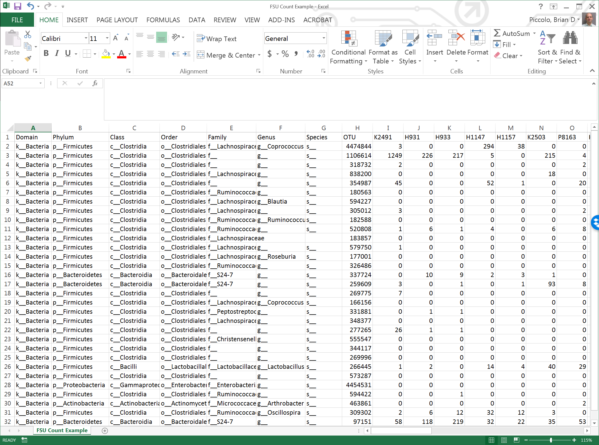
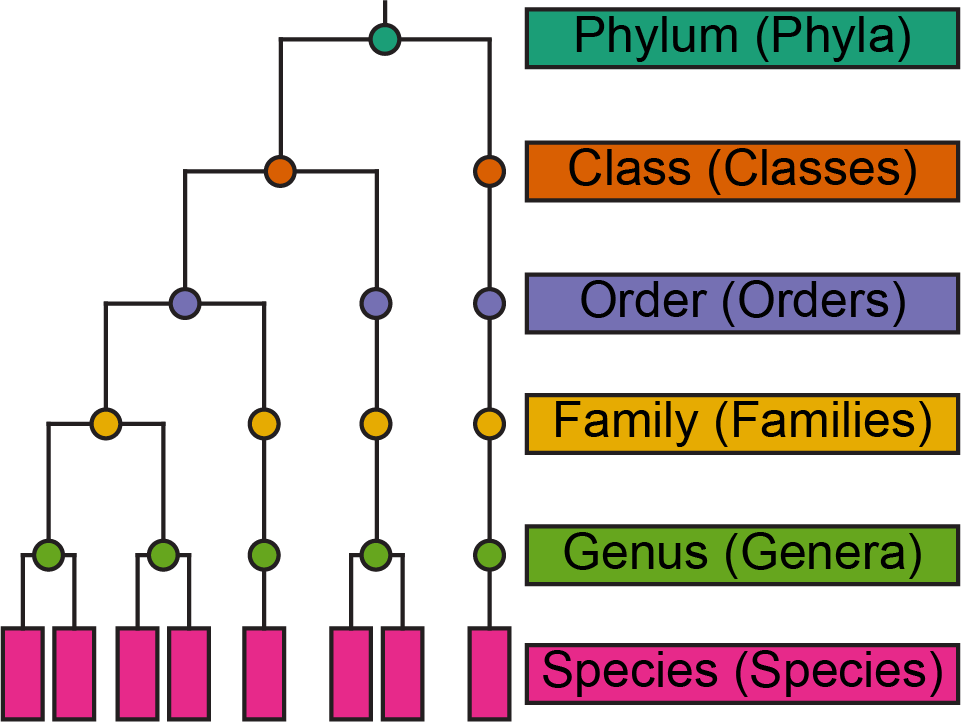
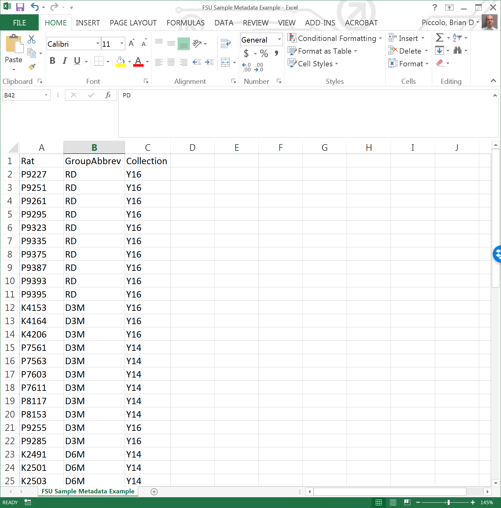
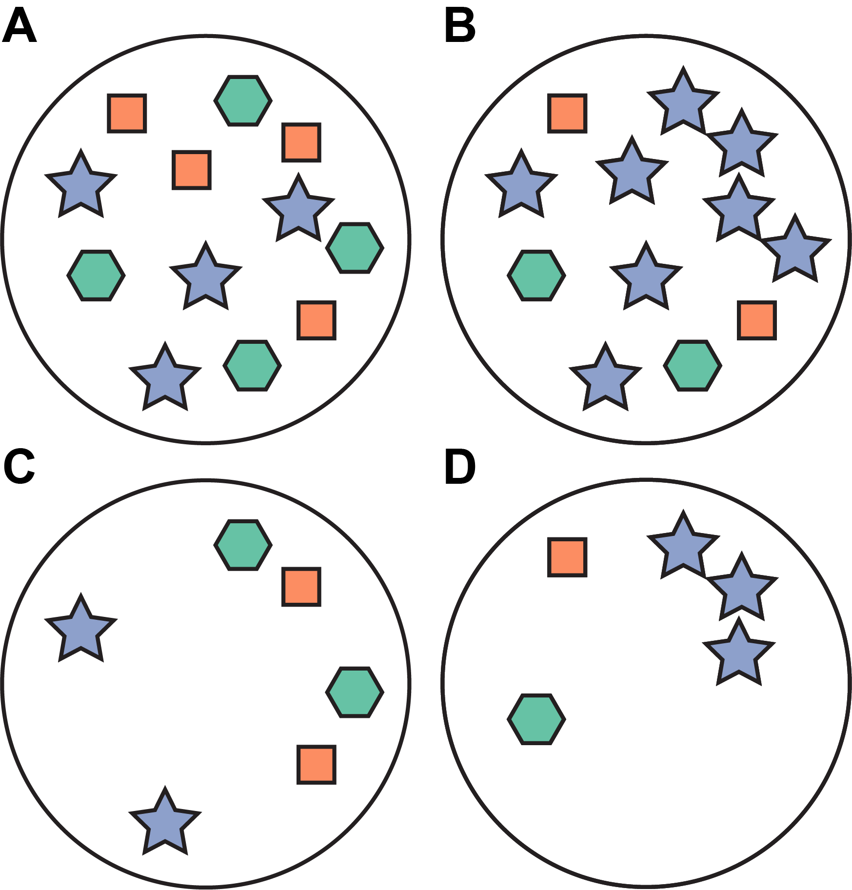
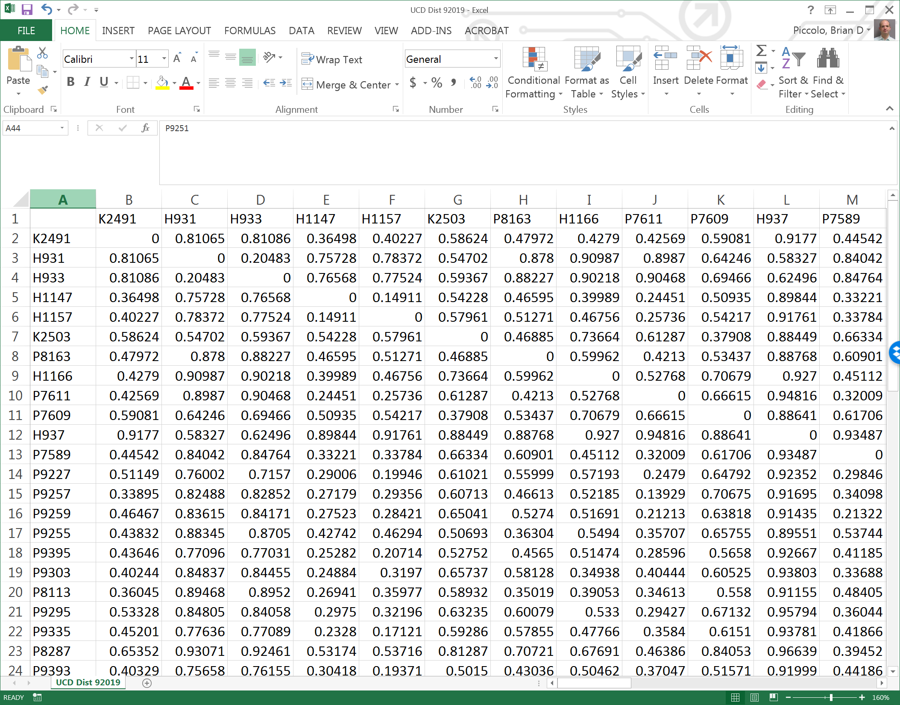

# Microbial Sequencing Data {#chapt3intro}

We were introduced to basic concepts of microbial sequencing data in Chapter \@ref(intro), but let's take a deeper dive into what kind of data we're dealing with.  Not going to lie, microbial sequencing data has several characteristics that are problematic for many statistical tools.  Let's use this chapter to discuss the characteristics of microbial sequencing data and the basic measurements that we can derive from it.

We will be data from a rat model of diabetes that was recently published at the American Journal of Physiology ([Piccolo et al., 2018, Am J Physiol Endocrinol Metab](https://www.physiology.org/doi/full/10.1152/ajpendo.00203.2018)).  This was a study investigating whether diabetes progression would alter the cecal content microbiota in UC-Davis Type 2 Diabetes Mellitus Rats, which spontaneously develop diabetes and maintain fully functional leptin signaling.  Cecal content microbes from age-matched rats who either had not developed diabetes (PD), recently developed diabetes (RD), 3-months post onset of diabetes, and 6-months post onset of diabetes were assessed using 16S rRNA and shotgun metagenomics sequencing. Additionally, cecal contents from lean Sprague Dawley (LSD) rats were also analyzed.  Rats were studied in either 2014 or 2016.  For this chapter, Excel spreadsheets will be displayed to assist visualizations and we will use this data in future chapters.  Data files used in this web-book can be found [here](https://github.com/bdpiccolo/FSU-Microbial-Data-Analysis/tree/master/Data).  The raw sequence files can be obtained at the [NCBI-Sequence Read Archive, SRA#SRP140861](https://trace.ncbi.nlm.nih.gov/Traces/sra/?study=SRP140861).

## Structure {#chapt3structure}

We discussed in Chapter \@ref(structure) that microbial sequencing data from 16S rRNA amplicon and shotgun metagenomic sequencing are counts of sequencing reads.  These sequencing reads could assigned to a unique identifier (e.g., 16S rRNA OTU number) or a bacterial species itself (shotgun metagenomics).  Microbial sequencing data could be provided in a spreadsheet formula, where the rows are taxa and columns are samples.  Typically, the first several columns will contain the taxonomy levels of each taxa (Figure 3.1).  It is possible that you may receive the data as proportions (i.e., relative abundance) rather than raw counts.  Although proportions are commonly used for data analysis, it means that the data has already been processed and limits several downstream analyses. Let's cover what the minimum types of data you should receive when obtaining microbial sequencing data.

(ref:count) Example of rRNA amplicon sequencing data.

```{r count, fig.cap='(ref:count)', out.width='80%', fig.asp=.75, fig.align='center', echo=FALSE}

```

### Count data

As described above, this is an example of your actual counts of sequencing reads.  The sequence counts begin on column 'I' in Figure 3.1.  Notice that all the counts are equal or above 0 and are whole numbers.  The raw data should be provided at the lowest taxonomic level that the technology allows.  For 16S rRNA sequencing data, this could be either Operational Taxonomic Units (OTU) or Sequence Variants.  Note in Figure 3.1, that there is a column for Species and OTU.  This is because 16S rRNA cannot provide species resolution.  Shotgun metagenomics analysis should provide species level data. 

### Taxonomy data

I like to think of microbial sequencing data as multi-leveled, because it can be assessed at various taxonomy levels (Figure 3.2).  Generally, the most granular level is going to give you the best biological representation of the bacterial community structure, but higher taxonomy levels have been known to differ in certain conditions.  For example, it has been well established that the phylum level Firmicutes are enriched at the expense of Bacteroidetes in obese rodents compared to their lean counterparts.  Sometimes, the higher level analyses can provide different insights into your microbial data that may not be apparent in granular level assessments.  Therefore, sequence counts in a particular taxonomy level can be summed up to higher levels.  I also refer to any taxon unit within a particular phylogenetic level globally as a "taxa", but these "taxa" will have a name within (i.e., circle or rectangle on Figure 3.2) as "taxa". 

(ref:taxa) Example of Phylogenetic Tree from Phylum through Species. Plurals of each levels are in paranthesis.

```{r taxa, fig.cap='(ref:taxa)', out.width='80%', fig.asp=.75, fig.align='center', echo=FALSE}

```

### Sample Metadata

This is your experimental data. Must include sample IDs that match the sequencing count data labels.  

(ref:metadata) Example of rRNA amplicon sequencing data.

```{r metadata, fig.cap='(ref:metadata)', out.width='80%', fig.asp=.75, fig.align='center', echo=FALSE}

```

### Phylogenetic tree

Phylogenic data is not absolutely required, but encouraged.  There are a couple well-used beta-diversity estimates (Unifrac) that require a phylogenic tree to calculate.  We will not cover phylogenetic methods in this course, but additional resources are [available](http://ape-package.ird.fr/).

## Files {#microbefiles}

### Spreadsheets

It is actually more practical to import three separate spreadsheet-based files for Count, Taxonomy, and Sample Meta data into R. After these files are imported in R, they will be packaged together as an individual object; thus, keeping them as a separate files is helpful, but not necessary.  Still, it is advised not to input a single Excel file formatted to containing all of these pieces in a single spreadsheet.  As covered in Chapter \@ref(datatypes), R will automatically import a vector as a character if it contains any non-numerical values.  Best way would be to create 3 separate files, with a single header row. 

### Biome {#biomfile}

A Biome file is a Biological Observation Matrix (BIOM) file that contains both Count and Taxonomy data. It is a popular output file for [QIIME1](http://qiime.org/), and also can be produced by [QIIME2](https://qiime2.org/).  I highly recommend using this format because it is generated directly from the sequencing informatics pipeline and has little-to-no opportunity for random errors associated with spreadsheet handling and formatting.  The biomformat R package was specifically designed to import biom files into R, so it is rather easy to import this file type.

## Diversity

You should always remember that microbial sequencing data is an estimate of a __microbiota__. Broadly defined, a microbiota is an ecological community of bacteria, archaea, viruses, fungi, and other micro-organisms. This microbial biodiveristy is dynamic and community members are working with or competing against other members for the limited available resources. Perturbations or alterations in the environment, e.g., changes in host health or alterations in energy substrates, can lead to major shifts in community biodiversity.  Thus, it is important to understand diversity measurements, as these ecological measures provide estimates of biodiversity and how it varies between environments or as a response to pertubations.   

### Alpha-diversity {#adivconcept}

Alpha-diversity is the biodiversity within a specified site (Figure 3.4).  In terms of microbial sequencing data, this would be the microbial diversity within a sample.  So, how many microbes were identified in a single fecal sample derived from a participant in your study, and what is the distribution of all microbes within this sample.  Are all sequencing count totals similar between all microbes within a sample, or are there only a few microbes with much greater counts relative to the rest?  These are some of the questions we can ask by estimating alpha-diversity.  Generally, the estimates provide a measure of richness and evenness within a sample.  There are MANY estimates of alpha-diversity, but we will go over a few of the most commonly used estimates in microbial studies.

(ref:adivexamp) Example of ecological diversity; each letter represents an indivual site or sample. (A) rich and even, (B) rich, but not even, (c) not rich, but even, and (D) not rich and not even.

```{r adivexamp, fig.cap='(ref:adivexamp)', out.width='80%', fig.asp=.75, fig.align='center', echo=FALSE}

```

#### Total amount

This is self explanatory. It is the number of observed taxa within a particular sample.  Estimate of richness can be biased in microbial studies due to the high prevalence of low abundant taxa.

#### Chao1

Estimates total richness, but makes a corrective factor based on the presence of singletons and doubletons. In this context, singletons and doubletons refer to a species that was detected once or twice, respectively, within a sample.  Thought to underestimate total richness if sample size is low.  

#### Abundance-Based Coverage (ACE)

Similar to Chao1, but correction factor is based on taxa with less than 10 counts.  Like, Chao1, will underestimate richness with small sample sizes.

#### Shannon's Diversity Index

The Shannon index incorporates both species richness and evenness.  It will increase as both richness and evenness increases.  

#### Simpson's Diversity Index

Similar to the Shannon index, but incorporates species richness as a proporation and dominance. If there is a dominant taxa, e.g., very high reads relative to others, then evenness is decreased.  If dominance is present, then the Simpson Index will be lower.

### Beta-diversity {#betadivconcept}

Beta-diversity refers to the variation between sites.  For example, how does the community of microbes in a fecal sample in one person differ from communites within all other fecal samples collected from other people.  How does the microbial diversity in a sample collected from your armpit differ then the biodiveristy in sample collected from between your toes?  Thus, beta-diversity measures the between sample variation in your samples.  Estimates of bio-diversity consist of distance-, dissimilarity-, or phylogentic-based calculations. These calculations are based on the comparison of 2 samples, then calculated across all pairs of samples.  This results in a symmetrical matrix with a diagonal containing zeros or ones (Figure 3.5).  Like alpha-diversity, there are many, many ways to estimate beta-diversity.  We will focus on a few here.

(ref:brayexample) Example of Bray-Curtis Dissimilarity matrix output.

```{r brayexample, fig.cap='(ref:brayexample)', out.width='80%', fig.asp=.75, fig.align='center', echo=FALSE}

```

#### Bray-Curtis Dissimilarity

One of the most popular diversity indices.  Calculated by summing the absolute differences between counts and then dividing by the abundances between the two samples.  Sometimes incorrectly referred to as a distance, but it violates a certain property of distances. Thus, it should always be referenced as a "dissimilarity" measure.

#### Jaccard Index

Measures diversity based on presence/absence.  More specifically, the Jaccard index is based on the co-presence of a taxa relative to the number of taxa present in at least one of the two comparative samples.  Think of a Venn Diagram.  The Jaccard index is essentially measuring the amount within the overlapping circles relative to the amount outside of the overlap.

#### Ordinations

This is not a measure of beta-diversity, but are multivariate statistical procedures that summarise a high-dimensional dataset into a new set of variables that can be visualized in a 2- or 3-dimensional plot.  Principal components analysis (PCA) is an example of an ordination.  PCA uses a covariance- or correlation-matrix, but a Principle Co-ordinante Analysis (PCoA) is a PCA that uses a distance or dissimilarity matrix instead.  Another type of ordination is multi-dimensional scaling (MDS): MDS tries to orient samples within a specified lower dimensional space that bests replicates the observed distances between samples.  There is a best-fit algorithm that measures how congruent (or not) the distance fit is and will stop at a specified criteria.  There are others, but we will only cover PCA, PCoA and non-multi dimensional scaling (NMDS) in this workshop.
 
## Challenges

I alluded to some difficult properties associated with microbial sequencing data earlier in this chapter (\@ref(chapt3intro)).  Let's take some time to understand these properties.

### Compositional data {#compdata}

It is becoming more appreciated that microbial sequencing data is compositional data, which [invalidates covariance- or correlation-based statistical techniques](https://www.nrcresearchpress.com/doi/10.1139/cjm-2015-0821#.XYUolC5Kj9Q). Compositional data refers to data which the total amount is arbitrary (meaningless) or each individual component sums to an arbitrary or equal amount.  How does microbial sequencing data fall into this space?  Let's consider what the data actually are: They are __counts__ of sequencing reads.  Thus, it does not exactly fit to what we are trying to measure (a microbial organism).  Additionally, the counts are finite based on the flow cell.  Thus, counts will sum to whatever the limit of the flow cell was to produce the data.  Furthermore, since there is a finite amount of reads, removing a taxa from a sample would mean that some other taxa would have to have a higher count.  

The good thing about sequencing data is that if you increase a certain bacteria, you are also going to increase the genetic material.  So sequencing does track changes in abundance; however, it does not provide an accurate measurement of the total number of taxa.  And that is the inherent limitations of the technology, that it will always be proportional based on the amount of reads available for sequencing.  A recent paper by Morton et al ([Nature Communications, 2019](https://www.nature.com/articles/s41467-019-10656-5)) provided an excellent example of the drawback to abundance data (Figure 3.6).  Briefly, Morton et al describes the fact that proportional differences may show the same differences even in cases where there are severe differences in the total microbial load between experimental groups.  

It has also been recognized for quite sometime that microbial sequencing data does not contain any information regarding the actual microbial load, thus, it is common to transform microbial sequencing data into a proportions where data is fixed between 0 and 1 within a sample. Multiplying by 100 will give relative percentages.  We are now clearly in a compositional space, where all samples have fixed and arbitrary sum.  Luckily, there are several transformations, e.g., the centered log-ratio and additive log ratio transformations, that can convert compositional data back to an euclidian space that makes the data more amendable for traditional statistical approaches.  However, there is still one more challenge to overcome that must be dealt with before you can transform your data with these procedures...

### Zero inflation

If you refer back to Figure 3.1, you'll notice there is one number that is more frequent than the others.  Zeros!  Microbial abundance is full of low abundant taxa and zeros are extremely prevalent.  It is a huge statistical hurdle, and unfortunately, I do not have a good answer for this limitation.  Generally, we will use a filtering criteria to remove low abundant taxa.  This normally takes some form of either removing taxa that have a certain percentage of counts at a defined level, say 10 counts in less than 50% of all samples will be removed.  Or, determine the proportional abundance and then remove taxa that have an average abundance < 0.1%.  By no means is there a consistent or agreed upon criteria to do this.  You may have to consider you group as well.  What if you're assessing the gut microbiota in infants fed breastmilk vs 2 different formulas with different sources.  You may have several microbes that are found in one diet but not in the others.  So, would you say you needs reads to appear in 33% of your samples because you have 3 groups?  But not all infants may seed a particular bacteria, so then do you make your cutoff at 50% of your lowest sample size?  Now you're adding taxa that may only be identified in 16-17% of your total sample size.  What if you have 5 diets?  As you can see, there is no good answer and it may depend on your study.

How do we deal with zeros?  A common technique is to add a small small constant to all samples to ensure there are no zeros, and then apply the transformations.  It also has been suggested to [impute zeros using a Bayesian-multiplicative replacement method](https://microbiomejournal.biomedcentral.com/articles/10.1186/2049-2618-2-15).  We will cover these transformations in the next chapter.

## Normalization

Variation due technical aspects of the analysis (e.g., sample collection, differences in bacterial load, and uneven sampling depth) is common in microbial sequencing data.  We have already discussed one normalization technique to combat these effects (proportional transformation), but there are several others that are used.  We will focus on some of the more straight foward normalization techniques.  Please refer to Weiss et al [Microbiome, 2017](https://microbiomejournal.biomedcentral.com/articles/10.1186/s40168-017-0237-y) for a more in depth description of these and others.

### Rarefying

This is the process of randomly removing counts from samples until all sample depths are even.  Remember, sampling depth refers to the total number of counts across all taxa within a particular sample.  So, rarefying equalizes the sample depth among all samples, but the drawback is you lose quite a bit of sensitivity due to the significant amount of data.  It also does not combat the compositional structure of the data and it may contibute to zero inflation in some cases.  Rarefy has been suggested for comparisons among samples with known and large differences between samples, e.g., colon vs duodenumn samples.  Some have [strongly advised against rarefying](https://journals.plos.org/ploscompbiol/article?id=10.1371/journal.pcbi.1003531), but others suggest it is [suitable for beta-analysis and does not increase false discoveries associated with differential analyses](https://microbiomejournal.biomedcentral.com/articles/10.1186/s40168-017-0237-y).

### Log upper quartile {#logUQ}

Similar to a proportional abundance, but each sample is divide by its 75th percentile of its count distribution rather than the sample sum.  The scaled data is then log transformed.  Like proportional scaling, ignores differences in sampling depth.  Log transformation means that special handling of zeros needs to be considered.

## R packages

We will mainly use ecology/microbiota based R packages for this workshop, [vegan](https://cran.r-project.org/web/packages/vegan/index.html), [phyloseq](https://bioconductor.org/packages/release/bioc/html/phyloseq.html), [ape](https://cran.r-project.org/web/packages/ape/index.html), and [microbiome](https://bioconductor.org/packages/release/bioc/html/microbiome.html).

### vegan

The vegan package contains is the major community ecology package in R and is maintained by several [ecologists](http://r-forge.r-project.org/projects/vegan).  While there are others ecology R packags that may have more specialized functions, vegan has the widest array of ecology based functions.  In fact, some of the other packages we'll use heavily rely on functions from this packages.

### phyloseq

Developed in Susan Holmes' lab at Stanford by Paul McMurdie. phyloseq is the most well-developed R package for complete handling of microbial sequencing data.  This group also maintains a [very nice website for phyloseq](https://joey711.github.io/phyloseq/index.html) and host several additional tutorials that contain [topics not covered in this workshop](https://joey711.github.io/phyloseq/tutorials-index.html).  

### microbiome

Written by Leo Lahti and Sudarshan Shetty.  Contains functions that extends phyloseq's functionalities.    

### ape

The ape package is major package for phylogenetic based analyses.  It is maintained by a large number of authors and has a wide range of functions for data analysis in a phylogentic framework. We will only be using this package for Principle Co-ordinate Analysis (PCoA).

## Additional resources

There are several online resources that provide data visualization and analyses for microbial sequencing data.  I am more familiar with some, but not all. The goal here is to provide alternative workflows for your convenience, especially for those that are more comfortable with graphical user interfaces (i.e., not coding based interfaces like R).  While many of these resources are very good at what they do, most will not integrate non-microbial data in your analysis and most do not produce scripts to track your analysis steps.  

[QIIME2](https://qiime2.org/) has now integrated analysis specific plug-ins to their informatics environment to become a 1-stop tool for all 16S rRNA informatics needs.  If you're already using QIIME2, then most of the topics we cover here will be available in QIIME2.  It is built in the Linux environment, so Windows users may not be able to access without a virtual box.  Bottom line, you need to be familiar with the Linux environment.  

I have [authored](https://academic.oup.com/bioinformatics/article/34/6/1050/4566177) a free [Shiny](https://shiny.rstudio.com/) app called [DAME](https://github.com/bdpiccolo/ACNC-DAME) that allows you to upload a Biom file and dynamically assess alpha- and beta-diversity measurements, and differential abundance between individual taxa.  It is only compatible with Biom files derived from QIIME1.  

The authors of phyloseq have also developed a Shiny app that is freely available, called [Shiny-phyloseq](https://academic.oup.com/bioinformatics/article/31/2/282/2365643).

[Calypso](http://cgenome.net/wiki/index.php/Calypso) is another web-based software that is freely available.  Files derived from QIIME and MOTHUR pipelines can be uploaded into Calypso for visualization and data analyses.

[MicrobiomeAnalyst](http://cgenome.net/wiki/index.php/Calypso) is another freely available web-based resources, developed by the same authors of the popular metabolomics web resource, [MetaboAnalyst](https://www.metaboanalyst.ca/home.xhtml).

## Final thoughts

We will cover the minimum analyses needed to publish microbial taxonomy data in this workshop.  Chapter 4 will detail importing microbial sequencing data into R and preparing the data for statistical analysis.  Chapters 5, 6, and 7 will cover alpha-diversity, beta-diversity, and differential analysis, respectively.  By no means does this cover all of the potential analyses available for microbial sequencing data, but will cover the minimum analyses needed to publish data derived from comparitive studies.   

I will provide examples in the subsequent chapters that I think you will encounter if using R.  It may seem too detailed for a relatively short workshop, but I'd like to make sure that you have sufficient information for some troubleshooting.  